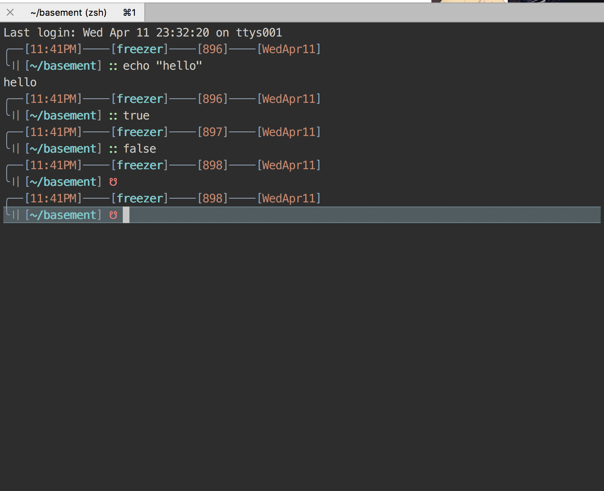

# walker-zsh-theme

## screenshot




## How to use

1. Put ``walker.zsh-theme`` into ``/your/theme/path/``
   e.g.

   ```
   cp ./walker.zsh-theme ~/.oh-my-zsh/themes/
   ```

   ​

2. Change your ``.zshrc``

   ```
   ZSH_THEME="walker"
   ```

   ​